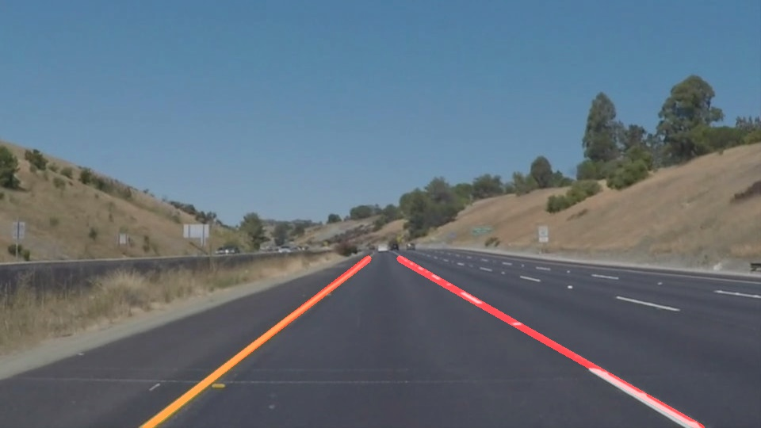

# **Finding Lane Lines on the Road** 

## Project Writeup

---

**Finding Lane Lines on the Road**

The goals / steps of this project are the following:

* Make a pipeline that finds lane lines on the road
* Reflect on the work in a written report

---

### Reflection

### 1. Pipeline Description

My pipeline consisted of the following steps:

1.  Converted the input image into its grayscale version. This gradient is required to be given as the input for the edge detection algorithm.

2. Applied Gaussian Blur with a kernel size of 5 in order to smoothen out the edges for the edge detection to work in a better way.
    
3. Used the Canny Edge detection algorithm to detect edges in the image.

4. Masked the image with a polygon so that only the portion which will have the lane lines will be considered to detect lines.

5. Applied Hough Transform to the masked image to obtain the lines in the image.

6. Used extrapolation techniques to draw a single solid line over the lane lines. To achieve this, the draw_lines() function is modified. The slope of the lines were considered to classify it into left and right lanes. Also, the intercept and slopes of these were stored in a list. Using the average of this slope and intercept and the min and max values of the Y-coordinate, X-coordinates were calculated and used to draw the single solid line on the image.

As seen from the above images, the lane lines are identified and a solid red line is drawn over them.

### 2. Potential Shortcomings

One potential shortcoming would be what would happen when shadows appear in the input. 

Another potential shortcoming can happen if the input image does not have enough brightness and the Canny and Hough algorithms may fail to identify lane lines from the image.

### 3. Possible improvements to the pipeline

A possible improvement would be to process the input image in the HSL color space, so that the algorithm can identify lane lines in low light or when shadows are present in the input image.
